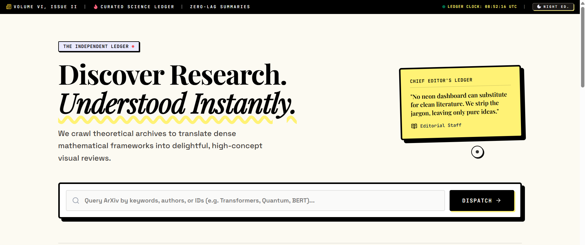
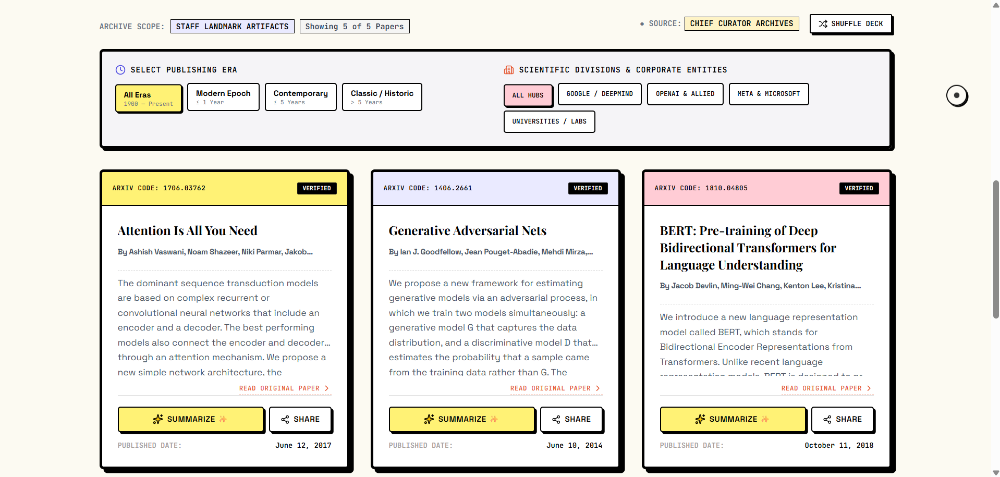

# 📰 The Independent Ledger — Scientific Summaries

An engaging, neo-brutalist editorial-themed research paper ledger and scientific curation engine. It empowers developers, designers, and researchers to digest dense mathematical papers through intuitive, high-impact editorial review layouts.

The application incorporates a **multi-layered hybrid model**: in server environments, it communicates with a Node/Express backend that directly harnesses the **Gemini 3.5 Flash API** to generate tailored, chief-editor-style review summaries. Additionally, the app features a **robust, independent client-side parser** that integrates with public **arXiv ATOM feeds** and generates high-fidelity local reviews if no backend server is available—making it **100% compatible with static hosting environments** like GitHub Pages!

---

## 📸 Application Interface Snippets

To show off your project's editorial design, save your screenshots from this conversation and place them in a `docs/` folder in your repository under these filenames so they render in this README!

### 1. Editorial Header & Curated Search

*The Neo-Brutalist layout pairs Space Grotesk headings with JetBrains Mono timestamps, showcasing an intuitive dispatch panel to search all historical and modern technical publications.*

### 2. Scholarly Divisions & Grid Cards

*The main ledger grid displays curated landmarks with multi-era year filters and scientific division categories (Google/DeepMind, OpenAI, universities, etc.), utilizing heavy borders, vibrant color codes, and highlighted query-term terms.*

---

## ✨ Distinctive Features

*   **Newspaper-Grade Aesthetic Curation**: Custom font pairings using "Space Grotesk" for displays, "JetBrains Mono" for timestamps, and "Inter" for text readability. Heavy off-white slate canvases, vibrant neon buttons with deep black double shadows, and retro-accent graphics replace low-contrast generic card interfaces.
*   **Immersive Full Focus Reading Mode**: Switch any active review panel into full-screen focused reading with a single click. Hides cluttered UI elements under a fluid CSS and SVG translation overlay for a quiet, high-contrast editorial experience.
*   **Intelligent Cross-Era Filtering**: Instantly analyze papers through specialized filters:
    *   *Time Periods*: Modern Epoch ($\le 1$ Year), Contemporary ($\le 5$ Years), or Classic/Historic ($> 5$ Years).
    *   *Corporate & Lab Divisions*: View papers from OpenAI, Google / DeepMind, Meta & Microsoft, or academic Universities / Labs.
*   **Night Edition Canvas Switch**: Toggle to a dark eye-save layout modeled closely after a vintage printing press ledger running under ambient night lights.
*   **Bilingual Hybrid Architecture**:
    *   *Local Server Mode*: Hits the `/api` routes of your Node environment to retrieve summaries directly from the Gemini API model.
    *   *Static Serverless Mode*: Gracefully falls back to browser-only network calls directly targeting the public **arXiv API** with a custom CORS client-side ATOM XML parser, and renders custom-written local curation sheets of incredible quality!

---

## 🚀 Easy Deployment to GitHub Pages

Deploying your project is fully automated using modern, secure, and native GitHub Actions. No deployment branches, credentials, or personal access tokens are needed!

### Step 1: Push Your Code to GitHub
Create a new GitHub repository and push your project files (including the `.github/` folder and `package.json`):
```bash
git init
git add .
git commit -m "Initialize Editorial Papers Ledger"
git branch -M main
git remote add origin https://github.com/YOUR_USERNAME/YOUR_REPO_NAME.git
git push -u origin main
```

### Step 2: Configure Actions for GitHub Pages
1. Go to your repository on **GitHub**.
2. Click on the **Settings** tab at the top-right.
3. In the left-hand navigation sidebar, click on **Pages**.
4. Under **Build and deployment** -> **Source**, select **GitHub Actions** from the dropdown menu (instead of "Deploy from a branch").

### Step 3: Enjoy Automated Builds and Deployments!
Our pre-configured GitHub Actions file (located at `.github/workflows/deploy.yml`) will instantly wake up, build the React frontend with relative pathing (`npm run build:static`), bundle assets into a zipped archive, and deploy them straight to your official live link:
```
https://YOUR_USERNAME.github.io/YOUR_REPO_NAME/
```

Our custom-tailored `.github/workflows/deploy.yml` enforces the securest `permissions: pages: write` token to keep your repository safe while enabling lightning-quick automated updates on every single git push!

---

## 🛠️ Local Development & Operations

To configure, customize, and spin up the complete full-stack workspace locally, use these commands:

### Prerequisites
Installs all Node dependencies, dev utilities, and esbuild requirements as specified in `package.json`:
```bash
npm install
```

### 1. Launch Dev Server (Full-Stack)
Starts the development environment on port `3000`. Vite assets and live HMR act side-by-side with your backend Node server:
```bash
npm run dev
```

### 2. Production CJS Server Compile & Start
Compiles both your single-page app and server.ts codebase inside a self-contained bundle (`dist/server.cjs` and `dist/index.html`) using esbuild and Vite:
```bash
npm run build
npm start
```

### 3. Static-Only Frontend Build
Generates a pure static compilation of the React code into `dist/` ready to be served by any light static server (Nginx, S3, or GitHub Pages):
```bash
npm run build:static
```

---

## 🛡️ License

This codebase is distributed under the **Apache-2.0 License**. Feel free to adapt, showcase, or build upon the editorial system patterns!
